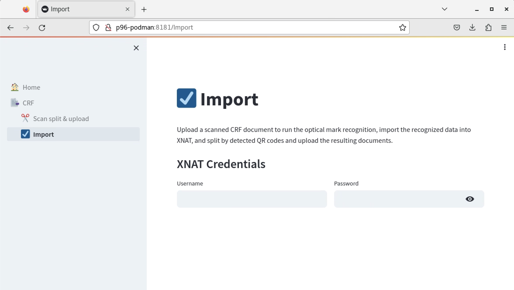
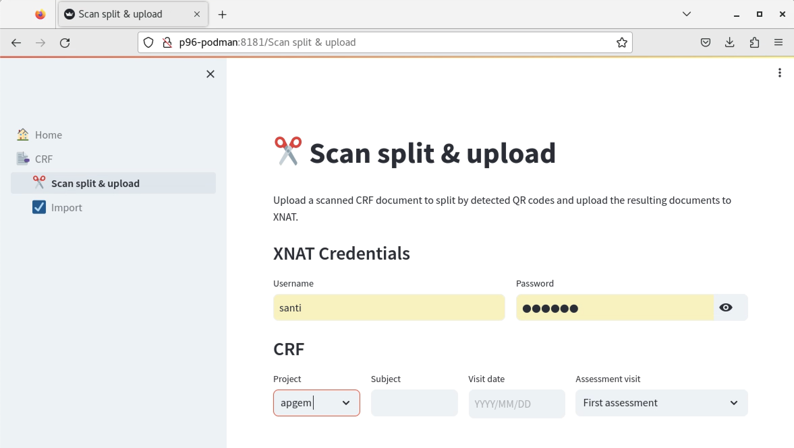
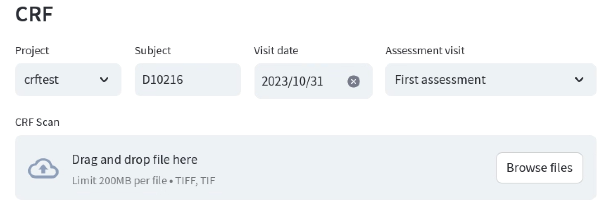
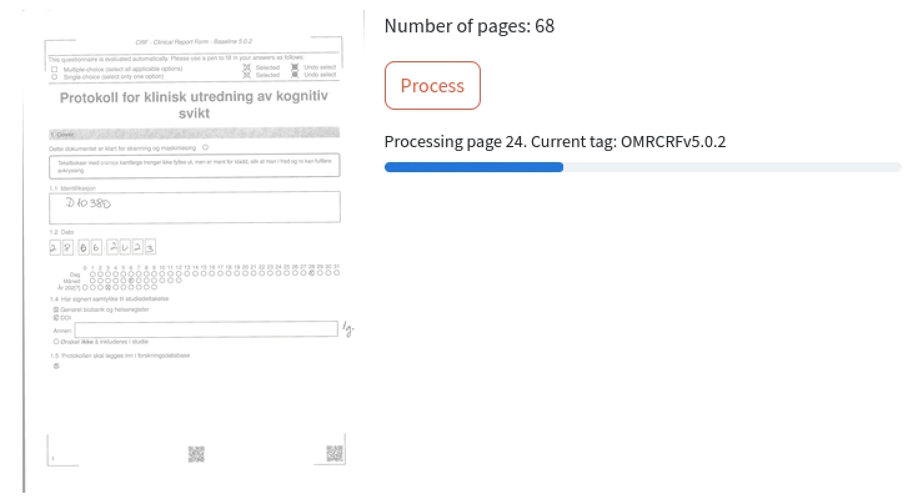
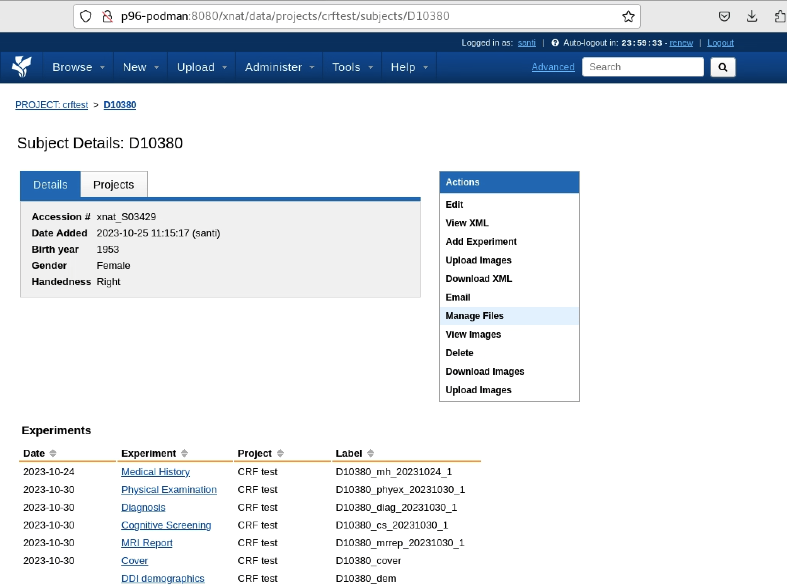
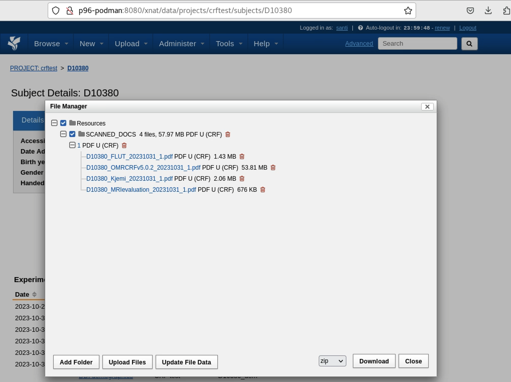

# User Documentation for CRF Splitter & Upload tool

## Overview

The CRF (Case Report Form) Splitter is a Streamlit app designed to upload scanned documents related to a patient visit (such as main CRF, MRI report, tests, etc.), split them by detected QR codes, and upload the resulting separate documents to XNAT. 

## Getting Started

### Launch the App

Open the DDI Tools app in your web browser at `http://p96-podman:8181`, then select the ✂️Split & upload section in the left navigation bar. The landing page displays a form to input XNAT login credentials.

### Login to XNAT

For the tool to be able to upload files to XNAT in your name, it needs you to provide your XNAT login credentials. Enter your XNAT username and password, then hit enter.

### CRF Section

After logging in, you will see a form with four fields and a file uploader:

1. **Project**: Choose the XNAT project from the dropdown list.
2. **Subject**: Enter the subject identifier. The subject must exist in the specified project.
3. **Visit Date**: Select the date of the assessment visit.
4. **Assessment Visit**: Choose the type of assessment visit from the dropdown list.

### Uploading and Processing

Once you enter the necessary data, the tool will allow you to upload the scanned file. Click the "Browse files" button to upload a scanned CRF document. The document should be in TIFF format.

Once a file is uploaded, the app will display the total number of pages in the TIFF document and a preview of the first page of the uploaded TIFF.

**Process**: Click the "Process" button to start the splitting and uploading process.

## Upload checking

Once all documents are uploaded, a success message will appear with a link to inspect the uploaded files in XNAT.

Click on the provided link to navigate to the XNAT subject to inspect the uploaded files. For that, click on the `Manage Files` action in the subject page.

The files are placed under the SCANNED_DOCS folder, having a subfolder for each visit. 

